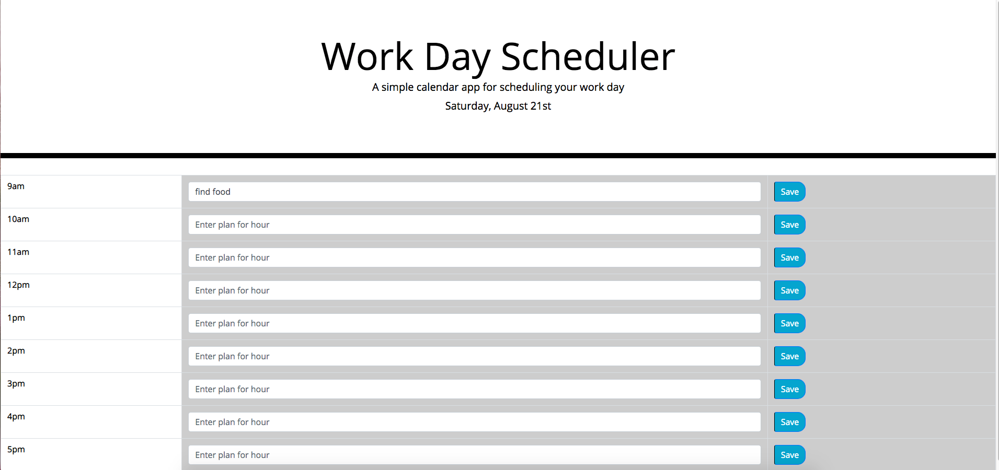

# Homework5_WorkDayScheduler

## App Description 
This app proves to be a useful day planner which spans over the hours of 9AM to 5PM. 
The app allows the user to type into the textbox for each hour and write in a plan for the hour.
Once the user types something into the box for an hour, they will need to press the save button to save their plan for the hour.
After pressing the save button, the user can safely refresh or close the app and come back to see their plan for the hour is still there.

## Motivation Behind the project/why I built it
My motivation to create this project was to be able to have an alternative to a paper planner which I would easily be able to access on my laptop.

## Problems I came across during development
During the creation of this project I came across a few problems. The biggest problem was I wanted to make the javascript as change-friendly as possible.
What I mean by this is that I wanted to be able to have a single function for each of my goals and simply be able to pass in each hour as a parameter. 
Although this was the original plan, it proved to be much harder to create it that way than I expected and I resorted to making an individual 
function for each hour that accomplished each goal.

## What I learned from this project
This project helped teach me how to use local storage better since I feel like it was one of those smaller things I brushed over.
The local storage really wasn't that hard and it serves as a necessity to the app.
Besides local storage, I also learned how to use moment and navigate documentation better.

## App usage
To use the app, simply open the link at the bottom of the readMe and type in a plan into the textbox for any of the hours and click the appropriate save button to save your response to local storage.
Upon refreshing or reopening the app, your plan will be found right where you left it (as long as local storage was not cleared).

## Link to the App
https://raws-boop.github.io/05_workday_schedule/